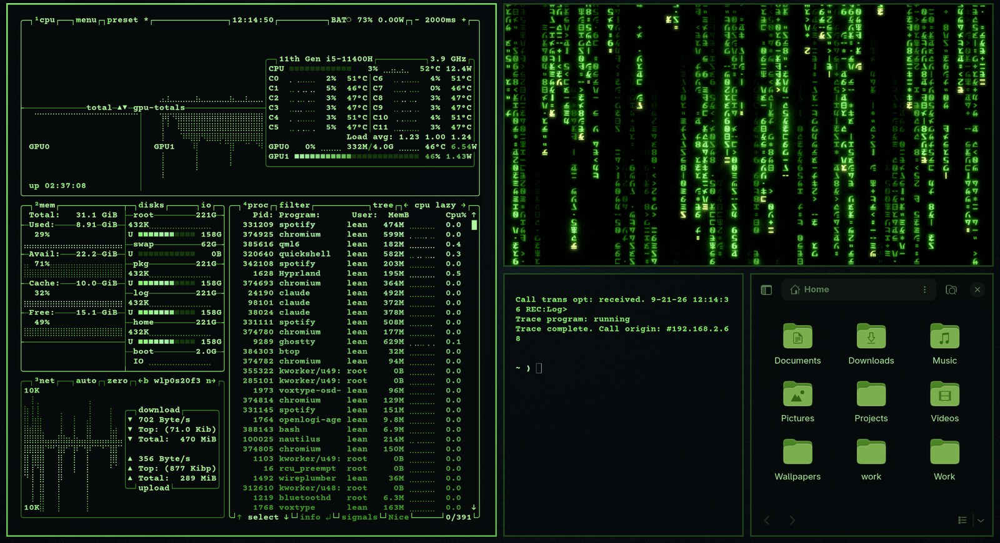
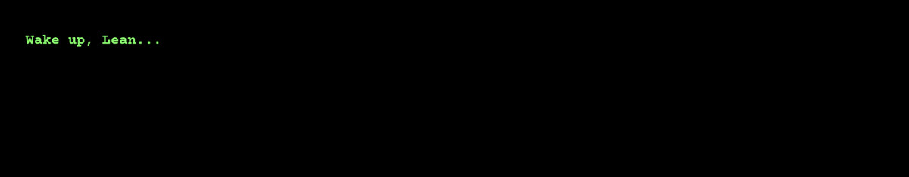
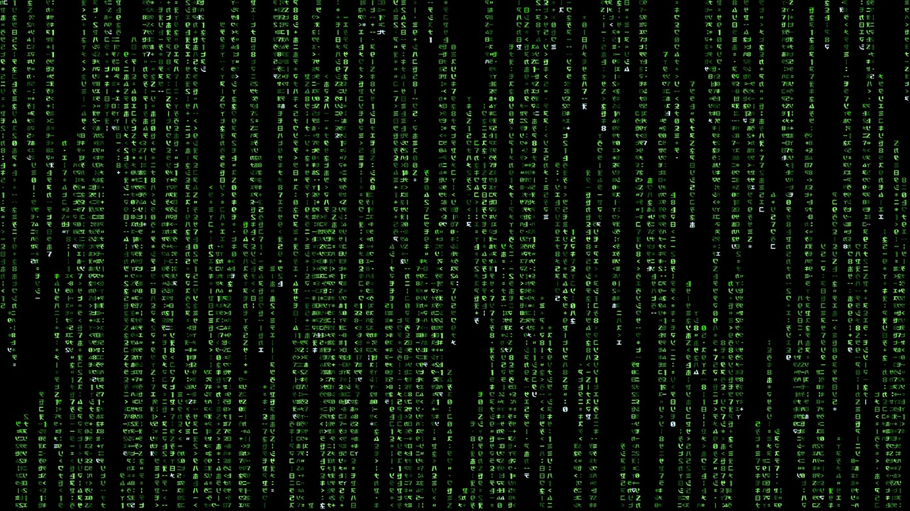
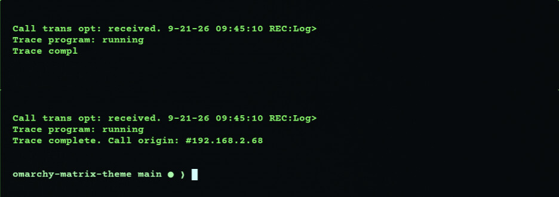
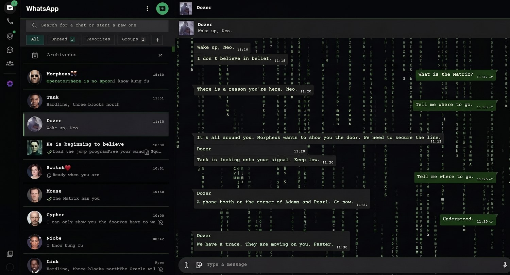
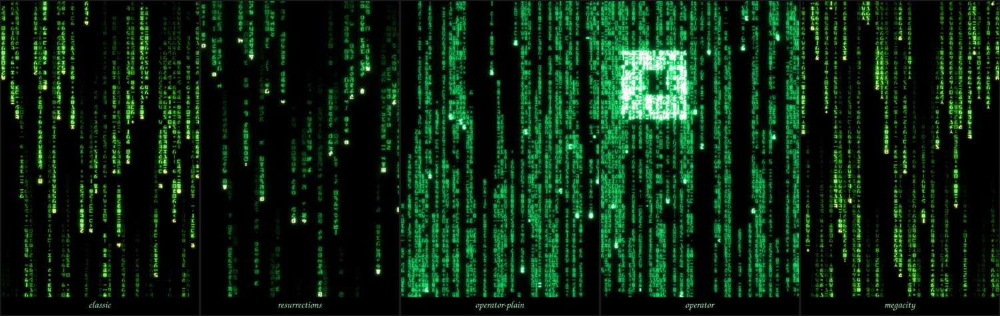

# omatrix

A *Matrix* theme for [Omarchy](https://omarchy.org/) — the desktop as a terminal
someone is watching the code on.



## What it is

The colours are **measured**, not chosen: every one is taken from the digital
rain's own ramp in
[matrix-rain](https://github.com/leandrolalanne/matrix-rain), which reproduces
Rezmason's reconstruction to within 0.7% on colour balance. The film's green
sits at **hue 108** — the `#00ff41` the internet reaches for is at 135, a
different colour.

Everything else follows from treating the desktop as a terminal:

| | |
|---|---|
| **Type** | Courier Prime Bold, the typewriter serif on Neo's monitor |
| **Corners** | square, everywhere |
| **Translucency** | 0.90, in the terminal itself so glyphs stay opaque |
| **Icons** | `Yaru-olive-dark`, the one installed green that is actually green |

## Two screensavers, alternating

The lines from Neo's monitor, typed out one at a time with your login name where
his goes, then erased:



And the rain, in the film's own glyphs, condensing into an OMATRIX wordmark:



## The terminal opens on the film's first screen



*The Matrix* opens on a screen, not on a face, and its script's stage direction
is already a terminal readout. The date and the origin are the real ones — the
trace that hunts Neo lands on this machine. It types itself out, and the digits
of the address lock into place the way the phone number does in the scene. About
360 ms, tunable to zero.

## WhatsApp Web



*The conversation above is staged — the theme is genuine, the chat is not.*

Black, square, lined in green. Grey incoming bubbles with green letters,
matrix-green outgoing with white, and every selector verified against the live
DOM.

## Install

```bash
git clone https://github.com/leandrolalanne/omarchy-omatrix-theme ~/.config/omarchy/themes/omatrix
~/.config/omarchy/themes/omatrix/install.sh
omarchy theme set omatrix
```

`install.sh` links the theme, its hooks and the background plugin.
`uninstall.sh` undoes all of it and hands back anything it swapped. The theme
ships static wallpapers, so it is complete on its own.

> **Use those three lines, not `omarchy theme install`.** That command clones
> the theme as a plain directory, and Omarchy holds a theme with a `.git` in it
> to a shorter list: `hyprland.lua` is dropped, which is where the squared
> corners and the blur setting live. It also never runs `install.sh`, so the
> hooks, the background plugin, the terminal translucency and the banner are all
> left out. Cloning yourself and running the installer links the theme instead,
> and a link is staged whole.

### The rain



The live backgrounds come from
[matrix-rain](https://github.com/leandrolalanne/matrix-rain), a separate
project: this theme is the consumer, and it mounts whatever that provider
declares. Five versions, each with its own glyph atlas and parameters.

**→ [github.com/leandrolalanne/matrix-rain](https://github.com/leandrolalanne/matrix-rain)**

```bash
git clone https://github.com/leandrolalanne/matrix-rain
cd matrix-rain
./install.sh
```

It needs **Qt 6 Declarative** — `sudo pacman -S qt6-declarative` on Arch — and
installs entirely under your home, no `sudo`. Re-run the theme's `install.sh`
afterwards to copy the live backgrounds in, then cycle wallpapers with
`Super+Ctrl+Space` until you reach one: selecting it turns the rain on.

It also gives you the two commands this theme is built around:

```bash
matrix      # the rain as a window on the desktop, in five versions
redpill     # the same rain inside the terminal you are typing in
```

### Pinning the screensaver

Omarchy picks its screensaver effect at random. To fix it on the matrix one
while this theme is active:

```bash
sudo scripts/install-screensaver-effect.sh
```

That shim in `/usr/local/bin` is the one part of this theme that writes outside
`$HOME`.

## Credits

The rain, its glyph atlases and its palettes are
[Rezmason/matrix](https://github.com/Rezmason/matrix), MIT, by way of
[matrix-rain](https://github.com/leandrolalanne/matrix-rain).

The default wallpaper, `07-crt-late-night.webp`, comes from the
[SolarOS](https://github.com/leandrolalanne/omarchy-solaros-theme) theme.

tymurbogach's
[enter-the-matrix](https://github.com/tymurbogach/omarchy-enterthematrix-theme)
established that Neo's monitor is set in a Courier-family typewriter serif — by
measuring against frames of the film — and that Bold is the weight. Its
stylesheet also worked out how WhatsApp's bubble corners are set, which this
reuses.

`fonts/` carries White Rabbit by Matthew Welch, MIT, with its licence.

Screensaver effects are [ttfx](https://github.com/omacom-io/ttfx), a Rust port
of terminaltexteffects, and the icons are Yaru.

> This is an **unpaid fan project**, released free under MIT. It sells nothing
> and claims no rights over anything it references. It is not affiliated with or
> endorsed by Warner Bros. or anyone else who owns a piece of *The Matrix*. If a
> rights holder would rather it did not exist, say so and it comes down.

## Licence

MIT, see [`LICENSE`](LICENSE). The wallpaper and the fonts keep their own.
